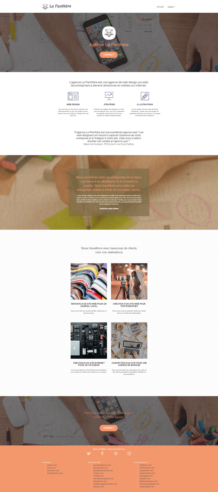

# **MyDevWebLearning-P4-project: SEO Agence La panthère**

Quatrième projet du parcours "Développeur web" chez OpenClassroom. L'objectif de ce projet est d'Optimisez un site web existant.

Vous trouverez [le brief complet du projet](https://openclassrooms.com/fr/paths/556/projects/638/assignment) ici.

## <ins>Aperçu du projet</ins>  &nbsp;

  

  &nbsp;

## <ins> Objectifs </ins>

1. Analyse de l’état actuel de SEO du site fourni.
2. Amélioration du SEO du site.
3. Comparaison des résultats.

## <ins> Livrables </ins>

- Un document PDF du rapport d’analyse SEO du site, utilisant le modèle fourni, dans lequel on identifie clairement les 10 recommandations (minimum) sélectionnées ;  
- Un document TXT contenant le lien vers le repertoire GitHub du code source complet du site amélioré ;
   
- Un document PDF du rapport d’optimisation comprenant une comparaison des résultats (y compris de la vitesse de chargement et l’accessibilité).

### <ins> Outils de test d'accessibilité</ins>

- Wave.

- Lighthouse.

- Axe Devtools.
   
- Analyseur de Contraste des Couleurs(CCA).
- NVDA(Lecteur d'Ecran)(https://www.nvaccess.org/download/).

### <ins> Tester le projet </ins>

Vous pouvez [visualiser rapidement le projet amélioré,](https://studentocdbx.github.io/LaPanthereAgenceWeb/) sur mon github pages. 